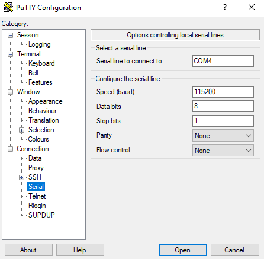
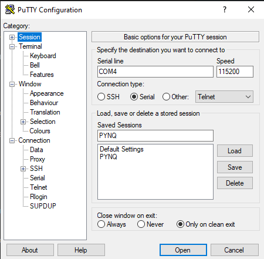

# Debugging Notes

## 1. Purpose
It is expected that there will be a lot of issues when first using the Xilinx and PYNQ toolchains. This markdown file aims to assist you with debugging your PYNQ board and give pointers to useful documentation / forum posts.

Feel free to provide further support to your coursemates by adding information of other commonly seen bugs (please make a branch and pull request).

Any questions? Contact Kevin through email (khl22@ic.ac.uk).

## 2. Bugs

### Vivado Y2K22
**Issue**: Vivado has a bug where the `ip_version` value, which is accessed as a signed integer (32-bit), causes an overflow and generates an error. This is for Vivado versions 2014.x through 2021.2.

Apply the following patch to fix the issue:
https://support.xilinx.com/s/article/76960?language=en_US

Related forum (explanation):
https://discuss.pynq.io/t/problem-rebuilding-base-v2-6/4042

## 3. Troubleshooting

For any issues with PYNQ, you can consult the following resources:
- [PYNQ Documentation](https://pynq.readthedocs.io/en/latest/)
- [PYNQ forum](https://discuss.pynq.io/)

### Refusing to connect
If your PYNQ board refuses to connect, try the following:
1. Check whether your ethernet cable to securely connected to the board - there should be lights on the board which indicate ethernet connection. Some of the PYNQ kits have old ethernet cables with loose ends. Try using a different cable.
2. Check your network settings. If you assigned a static IP address, ensure that the IP address is correct.
3. Get a terminal on the board. (if you are unsure how, refer to the [section on getting a terminal](#getting-a-terminal)). Run `ifconfig` to check that its `eth0:1` IP address is what you expected (usually `192.168.2.99`). If it is not, try running your the indicated IP address with port 9090.
4. If you are still unable to connect, try restarting your PYNQ board, which usually does the trick. Get a terminal and run `sudo reboot`, or unplug and replug power from the board

> If you are unable to even get a terminal on the board, then you might have flashed the wrong image - make sure you are flashing the SD card with the PYNQ Z1 image, not the Z2 image.

### Limited storage space
Vivado and Vitis are huge programs, and they require a lot of space to install. You can usually see the expected space required in the installation setup tool. Note that the space required for extraction and download is larger than the final installation size.

If you don't have enough space, the best method is to reduce the amount of board support selections. Since you are only expected to use the PYNQ-Z1 board, which is a Zynq-7000 series board, you can deselect support for all other boards types to reduce the installation size.

### Board parts not found (in Vivado during project creation)
Refer to https://github.com/Digilent/vivado-boards

### WiFi connection not active
The best indication is always to try and `ping -c 4 8.8.8.8` to see if you have an active internet connection. If you are unable to ping, then your WiFi connection is not active. Note that packet losses may occur if the dongle is too far from the router.

Steps to take:
1. Unplug and replug the WiFi dongle to the board. Do a `sudo reboot` to restart the board.
2. Use `ipconfig` and `ipaddr` to check your network settings. Your Wifi should be `wlan0` and have an IPv4 address assigned to it.
3. You Wifi connection might not be active. Run `nmcli radio wifi` to check if your WiFi is enabled. If it is not, run `nmcli radio wifi on` to enable it.
4. Run `nmcli device wifi list` to see the available networks. If your network is not listed, run `nmcli device wifi connect <SSID> password <password>` to connect to your network.
5. Run `nmcli connection show --active` to see the active connections.

## 4. References

### PYNQ resources
For any issues with PYNQ, you can consult the following resources:
- [PYNQ Documentation](https://pynq.readthedocs.io/en/latest/)
- [PYNQ forum](https://discuss.pynq.io/)
- [PYNQ YouTube tutorials](https://youtube.com/playlist?list=PLjVZA8Z_co6KBmqzyHfzKnJ8LmYd7cU03&si=lTCQ5iMN9KToyjBG)

### Getting a terminal

#### SSH

__Windows__
The easiest way to SSH on Windows is via the terminal emulator PuTTY, which you can download from the following link: https://www.chiark.greenend.org.uk/~sgtatham/putty/latest.html. Configure it to use SSH, with username `xilinx`, hostname `192.168.2.99`, and password `xilinx`.

__Linux__
From a terminal emulator on your computer, type `ssh xilinx@192.168.2.99`. The password is `xilinx`.

#### Serial console

If SSH isn't working, you can also try getting a serial console on the PYNQ board. Your computer must be connected to the board via MicroUSB.

__Windows__
In the "Serial" category of PuTTY, configure the following settings:
- Serial line: `COM4` (different for every user, for Windows users check Device Manager and see which COM port your PYNQ board is connected to)
- Speed (baud rate): `115200`
- Data bits: `8`
- Stop bits: `1`
- Parity: `None`
- Flow control: `None`

After configuring the serial settings, go to the "Session" category and save the configuration as `PYNQ` (or whatever name you prefer). This will allow you to quickly load the same settings in the future.

Finally, click "Open" to establish a connection to the PYNQ board.

__Linux__
There are many serial console clients. A simple one is `minicom`, which can be used to connect to the PYNQ board by running `minicom -D /dev/ttyUSB0` from a terminal emulator on your computer. You may need to either run this with `sudo` or add yourself to the appropriate group (e.g. `uucp` on Arch Linux or `dialout` on Debian/Ubuntu) to have permission to access serial device nodes.

If your board is not at `/dev/ttyUSB0`, consult `sudo dmesg | grep tty`, and look for something like `FTDI USB Serial Device converter now attached to ttyUSB1` to find the device node.
