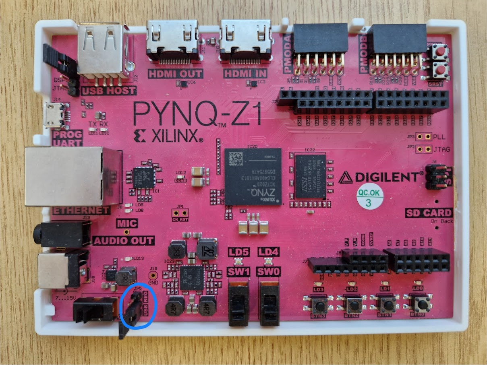
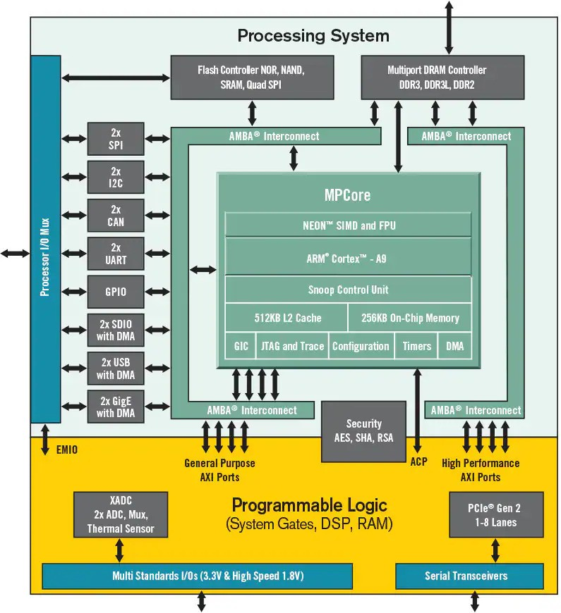
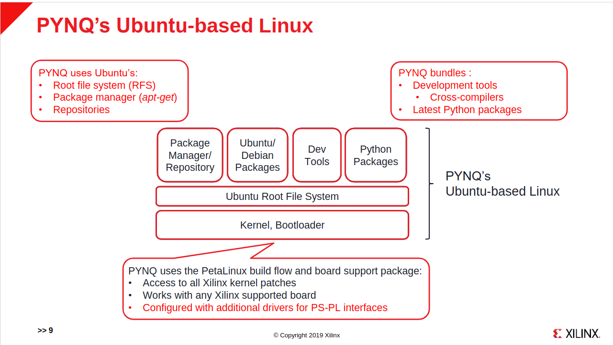
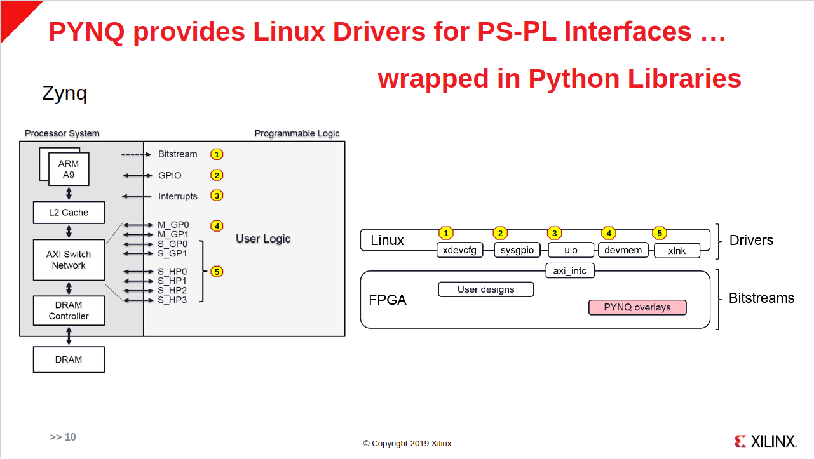
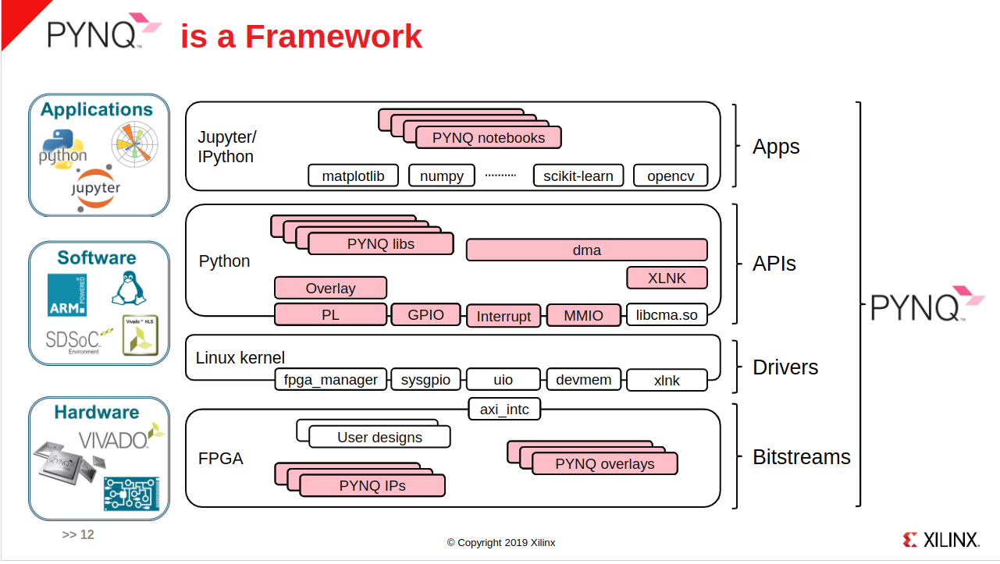

# Lab 1: Introduction to PYNQ and Vivado

## 1.1 Environment setup

### Toolchain versions

To get started with the labs, we will first setup the required toolchain - this might be a bit troublesome, so please take advantage of the debugging notes `debug.md`.

In this lab, we will use the PYNQ-Z1 board.
> The lab was built on Windows 10, using PYNQ release version v2.7 and Xilinx Tool Version 2020.2. Feel free to use a more recent release version, but avoid using any release version before PYNQ v2.7.
>
> @Cheng: The lab was tested on Windows 11, using PYNQ release version v3.1 and Xilinx Tool Version 2024.1.

Note: Vivado's projects and tcl scripts are forward compatible, but not backwards compatible.


> Source: <https://pynq.readthedocs.io/en/latest/pynq_sd_card.html>

The latest available version is v3.1, which corresponds to Xilinx 2024.1.

If you encounter any issues, please first refer to the debugging notes `debug.md`, before approaching the TAs or the module leader.

Operating system requirements: Windows 10 or 11, Linux (Ubuntu)

- If you are using a MacOS device, options include:
  - Virtual machine (VM)
  - Using lab computers

### Step 1: Install Vivado

Go to the following [page](https://www.xilinx.com/support/download.html) to download Vivado.  For limited storage issues, refer to [debug.md](../debug.md/#limited-storage-space).

### Step 2: Flashing the PYNQ image

Download the [Pynq SD Card Image](https://www.pynq.io/boards.html) onto the Pynq SD Card. You can use [Raspberry Pi Imager](https://www.raspberrypi.com/software/) to write the image.

### Step 3: Setting up the board

> 📝 Please Watch video [Setting up your PYNQ-Z1 board](https://www.youtube.com/watch?v=SuXkbcK3w9E) before proceeding.

Once you have flashed the PYNQ image onto your SD card, insert it into the PYNQ-Z1 board and connect the power supply. The board should be powered by either a micro-USB cable or a 5V power supply. Remember to switch the pin on the board to either use the USB or power supply.



Let us now look into how the board works. The most important component is the Zynq-7000 System-On-Chip (SoC), which contains the Processing System (PS) made up of an ARM-Cortex A9 core, as well as the Programmable Logic (PL) which can be configured with custom hardware designs that we will soon create in Vivado. The block diagram for the Zynq-7000 SoC is shown below:



> Source: <https://www.mouser.co.uk/new/xilinx/xilinx-zynq-7000-socs/>

On top of this, the PYNQ framework provides a full Ubuntu-based Linux distribution on the SD card, with Linux drivers for the interfaces between the PS and PL, wrapped in Python libraries which makes the design easier. The following excerpt from Xilinx's introduction to PYNQ gives an excellent visual representation of the overall systems you will be working with:

|   |
| ------------------------------------------------------------ |
|  |
|  |

> Source: <https://github.com/Xilinx/PYNQ_Workshop/blob/master/01_PYNQ_Workshop_introduction.pdf>

### Step 4: Connecting to Jupyter Notebook

By default, PYNQ uses a web interface to interact with the FPGA board. We will now connect to the board's Jupyter Notebook server via Ethernet. Connect the Ethernet cable to the board and your computer. If your computer does not have an Ethernet port, you can use an Ethernet adapter.

> Note: if you connect Ethernet directly to your computer, PYNQ will not have access to the internet unless you bridge your computers internet connection. This means you will not be able to update system packages.

#### Assigning a Static IP

PYNQ by default uses a static IP address of `192.168.2.99`. You should configure your laptop to also have an IP address **on the same subnet as the PYNQ-Z1 board** (i.e. `192.168.2.X`) to be able to access the Jupyter Notebook server.

**Windows**
Open up the `Network and Sharing Center`, and click on the `Ethernet connection`. Click on `Properties`, and then double-click on `Internet Protocol Version 4 (TCP/IPv4)`. Assign the following IP address: `192.168.2.X` where X is any number between 0 and 255, other than 99.

**Linux**
See the PYNQ documentation: <https://pynq.readthedocs.io/en/latest/appendix/assign_a_static_ip.html#assign-a-static-ip-address>

#### Open Notebook in browser

Now, open up your web browser and type in the following address: `192.168.2.99:9090`, which is PYNQ's default IP address. The default password is `xilinx`

> Is your PYNQ board refusing to connect? Refer to the troubleshooting section in [debug.md](../debug.md/#refusing-to-connect). Troubleshooting might require the use of a SSH/Serial terminal.

### Getting a terminal (optional)

You may have encountered terminals in various forms before in your work or previous modules. They can be very useful for controlling devices that are remote, low-powered, and/or have little I/O hardware of their own.

The section on getting a terminal in [debug.md](../debug.md/#getting-a-terminal) explains how to get a terminal, either via SSH or a Serial console.

Note that this is not strictly necessary, as you should be able to use the Juputer Notebook interface to directly interact with your PYNQ board. However, having a terminal is useful for troubleshooting in cases where your board refuses to establish a connection.

## 1.2 FIR filter

Now we are ready to get started. Open up Vivado and create a new project.

> Credits to [this tutorial](https://www.fpgadeveloper.com/2018/03/how-to-accelerate-a-python-function-with-pynq.html/) by Jeff Johnson for this section. If you get lost in this section, feel free to refer to his YouTube tutorial.

> Also credits to Sanjit Raman for helping with screenshots in this section. You will see Vivado 2024.2 version on Ubuntu being used for some of the screenshots, which might differ from the version you are using - the version should not matter in this section.

### Step 1: Creating a new project

1. Open up Vivado and create a new project.
2. Press Next after reading the wizard.
3. Enter a suitable name and location for the project (such as `lab1`). Ensure check subdirectory is enabled so that your project files are contained in a parent folder.
4. Press Next.
5. Select RTL Project, for now: "do not specify the sources".
6. Press Next.
7. Select the PYNQ-Z1 board. Double click on the part number to select it and move onto the summary.

    > 📝 If you are unable to find PYNQ-Z1, go to `Parts` instead of `Boards`, and select `xc7z020clg400-1` part.

8. Press Finish.


> Board part troubleshooting: If you are unable to find the PYNQ-Z1 board, refer to the troubleshooting section in [debug.md](../debug.md/#board-parts-not-found). Note that instead of clicking on `Boards`, you may also directly select from `Parts` the board part part (xc7z020-1clg400c).

### Step 2: Creating the block design

On the column on the left hand side, click `Create Block Design`. You can leave the block design name as `design_1` for now.


Add the Zynq7 processing system - this contains the interfaces to the dual ARM cores on the FPGA. Double click on the Zynq7 PS block. Inside the Zynq7 PS IP settings, there is a part which notes how many HP slave ports are needed (only one needed in this case, HP0).


Add the `Direct Memory Access` (DMA) block.


Double click on the `AXI DMA` block to customise it. Disable `Enable Scatter Gather Engine`. Maximise the size of the `Width of Buffer Length Register` to 26 bits. Press ok to exit the wizard.

Add the FIR filter: Vivado provides a wizard called the `FIR Compiler` which helps you to design your own filter.


Create the FIR filter by specifying the coefficients. Double click on the FIR Compiler block to customise the IP, and paste in the following coefficients:

```
-255, -260, -312, -288, -144, 153, 616, 1233, 1963, 2739, 3474, 4081, 4481, 4620, 4481, 4081, 3474, 2739, 1963, 1233, 616, 153, -144, -288, -312, -260, -255
```

Next, on the `Channel Specification` tab: change the `Input Sampling Frequency` and the `Clock Frequency` to 100MHz. Thus each clock tick on the FPGA will feed one input to the FIR filter.

On the Implementation tab: we should change the `Input Data Width` to 32 bits. We also want the output to have 32 bits, so select the `Output Rounding Mode` to `Non Symmetric Rounding Up` and then change the `Output Width` to 32 bits.

In the `Interface` tab, we specify how this block should communicate on the AXI bus, in this case, we should enable `Output TREADY` and `TLAST` via `Packet Framing`. It is slightly out of scope to read into the AXI Stream protocol, but if you are interested, you may want to read up on it.

Press OK to end the customise IP wizard.

Next, we connect the `M_AXIS_DATA` from the output of the FIR compiler to the `S_AXIS_S2MM` (Slave AXI interface for Stream-to-Memory-Mapped transfers) input port of the AXI DMA Block.

Then, we connect the `M_AXI_S2MM` (Master AXI interface for Stream-to-Memory-Mapped transfers) ouput port of the DMA to the `S_AXIS_DATA` input port of the FIR Compiler. This allows us to feed a memory-mapped data format used by the DMA into the streaming input of signal data that the FIR compiler expects.

Your block diagram should look like this:


Now, we connect this up to the ZYNQ Processing System, so that the DMA can access the DDR Memory that is present in the PS.

Double click the ZYNQ7 Processing System to edit it, and double click on the `High Performance AXI Slave Ports` to edit them. Enable one port, for example the `HP0` port. Then save and exit the customization.


Next, Run Block Automation.


Also, Run Connection Automation - Vivado intelligently maps input ports and output ports together. Select all the ports in the tree view.


Press F6 to validate your design. You will see incomplete address path warnings. Run Connection Automation again.


Rename the `FIR Compiler` block to `fir`, and the `AXI DMA` block to `fir_dma`. This will make it cleaner to access in the Jupyter Notebook when we are utilising these accelerators.


You should have a design that looks something like this:


### Exporting the hardware

Now that the design is completed, click `F6` to validate your design. If validation is successful, double click on `design1.bd` under "Design Sources" in the "Sources" window. Then select "Create HDL wrapper". Once that is completed, Go to the sidebar on the left, and run "Generate Bitstream". This should automatically run Synthesis and Implementation.


> Synthesis translates your HDL code into a gate-level netlist of logical components (LUTs, flip-flops, DSPs, etc.) that can be implemented on the FPGA fabric. Implementation then places those components onto physical FPGA resources and routes the connections between them, while bitstream generation creates the binary configuration file that programs the FPGA.

Now to run your design on the PYNQ board, we need three files: a `tcl` file, a `hwh` files, and a `bit` file.

To obtain the three files:

- For `.tcl`: File > Export > Export Block Design
- For `.hwh`: `lab1/lab1.gen/sources_1/bd/design_1/hw_handoff/design_1.hwh`
- For `.bit`: `lab1/lab1.runs/impl_1/design_1_wrapper.bit`. Rename the file to `design_1.bit`

Replace "lab1" with whatever you named your project.

### Loading the overlay on Jupyter Notebook

Once you have obtained the files, connect your laptop to the PYNQ board.

On your laptop browser, type in: `192.168.2.99`. When prompted with a password, enter "xilinx".

Create a new folder (e.g., `InfoProc-lab1`) and upload your three files onto it, along with the provided Jupyter Notebook `jupyter_notebook/fir`.


Click open the Jupyter Notebook. Run the cells and follow the instructions on the notebook, and observe the speed of the hardware IP for FIR filters compared to the software functions.

## 1.3 Simple register control (merge array)

Here we attempt a simple array merging procedure. The purpose is to get a better understanding of how MMIO (memory-mapped IO) works and how to do simple register control.

Let's start off by creating a block design which allows us to do the operation below, but in hardware:

```
[1,3,5] + [2,4,6] => [1,2,3,4,5,6]
```

> Reference video for a similar design: [Make a RTL-based IP work with PYNQ - AXILite adder](https://youtu.be/RPTuhVeoGTI?si=gbzsbD1SdPM9QIfI)

### Step 1: Creating the block design

Similar to the previous section, we first create a project (you can name it `merge_array`).

1. Creating the block design

We first create a block design, and include the Zynq 7 processing system.

2. Creating the merge array ip

Select `Tools > Create and Package New IP`.

When prompted with options, select "Create a new AXI4 peripheral".


Feel free to name it anything you want to, in this example we name it `merge_array` with version 1.0.


You will be prompted to add AXI4 interfaces to be supported by your peripheral. Not much changes are needed here, just make sure you set the number of registers to 5.


Lastly, we create the peripheral with options "Edit IP". This will prompt Vivado to open a new window where you can edit this merge array IP.


3. Modifying the merge array ip

I'll guide you through transforming the first template into the second one step by step.

Initially, we see the following:


Let's first modify this `merge_array_v1_0_S00_AXI` Verilog file.

After the existing signal declarations (after `reg aw_en;`), add:

```systemverilog
reg  aw_en;

// Add these new signals:
wire fsmStart;
wire sortDone;
reg fifo1_wr_en;
reg fifo2_wr_en;
wire [31:0] mergedFifoRdData;
```

After the I/O connection assignments (after `assign S_AXI_RVALID = axi_rvalid;`), add:

```systemverilog
assign S_AXI_RVALID = axi_rvalid;

// Add this:
assign fsmStart = slv_reg0[0];
```

Find the large `always` block:

```systemverilog
always @( posedge S_AXI_ACLK )
begin
  if ( S_AXI_ARESETN == 1'b0 )
    begin
      slv_reg0 <= 0;
      slv_reg1 <= 0;
      slv_reg2 <= 0;
      slv_reg3 <= 0;
      slv_reg4 <= 0;
    end
  else begin
    if (slv_reg_wren)
      begin
        case ( axi_awaddr[ADDR_LSB+OPT_MEM_ADDR_BITS:ADDR_LSB] )
          // ... all the case statements ...
        endcase
      end
  end
end
```

**Delete this entire block** and replace it with:

```systemverilog
// slv_reg0 handling
always @( posedge S_AXI_ACLK )
begin
  if ( S_AXI_ARESETN == 1'b0 )
    begin
      slv_reg0 <= 0;
    end
  else begin
    if (sortDone)
       slv_reg0 <= 0;
    if (slv_reg_wren && axi_awaddr[ADDR_LSB+OPT_MEM_ADDR_BITS:ADDR_LSB] == 0)
       slv_reg0 <= S_AXI_WDATA;
  end
end

// slv_reg1 handling
always @( posedge S_AXI_ACLK )
begin
  if ( S_AXI_ARESETN == 1'b0 )
    begin
      slv_reg1 <= 0;
    end
  else begin
    if (sortDone)
       slv_reg1 <= 1;
    if (slv_reg_wren && axi_awaddr[ADDR_LSB+OPT_MEM_ADDR_BITS:ADDR_LSB] == 1)
       slv_reg1 <= S_AXI_WDATA;
  end
end

// fifo1_wr_en handling (replaces slv_reg3)
always @( posedge S_AXI_ACLK )
begin
  if ( S_AXI_ARESETN == 1'b0 )
    begin
       fifo1_wr_en <= 0;
    end
  else begin
    if (sortDone)
       slv_reg0 <= 0;
    if (slv_reg_wren && axi_awaddr[ADDR_LSB+OPT_MEM_ADDR_BITS:ADDR_LSB] == 3)
        fifo1_wr_en <= 1'b1;
    else
        fifo1_wr_en <= 1'b0;
  end
end

// fifo2_wr_en handling (replaces slv_reg4)
always @( posedge S_AXI_ACLK )
begin
  if ( S_AXI_ARESETN == 1'b0 )
    begin
       fifo2_wr_en <= 0;
    end
  else begin
    if (sortDone)
       slv_reg0 <= 0;
    if (slv_reg_wren && axi_awaddr[ADDR_LSB+OPT_MEM_ADDR_BITS:ADDR_LSB] == 4)
        fifo2_wr_en <= 1'b1;
    else
        fifo2_wr_en <= 1'b0;
  end
end
```

Find the `always @(*)` block for address decoding:

```systemverilog
always @(*)
begin
      // Address decoding for reading registers
      case ( axi_araddr[ADDR_LSB+OPT_MEM_ADDR_BITS:ADDR_LSB] )
        3'h0   : reg_data_out <= slv_reg0;
        3'h1   : reg_data_out <= slv_reg1;
        3'h2   : reg_data_out <= slv_reg2;
        3'h3   : reg_data_out <= slv_reg3;
        3'h4   : reg_data_out <= slv_reg4;
        default : reg_data_out <= 0;
      endcase
end
```

**Replace with:**

```systemverilog
always @(*)
begin
      // Address decoding for reading registers
      case ( axi_araddr[ADDR_LSB+OPT_MEM_ADDR_BITS:ADDR_LSB] )
        3'h0   : reg_data_out <= slv_reg0;
        3'h1   : reg_data_out <= slv_reg1;
        3'h2   : reg_data_out <= mergedFifoRdData;
        default : reg_data_out <= 0;
      endcase
end

assign mergedFifoRdEn = slv_reg_rden && (axi_araddr[ADDR_LSB+OPT_MEM_ADDR_BITS:ADDR_LSB] == 2);
```

At the bottom, in the "User logic" section, replace:

```systemverilog
// Add user logic here

// User logic ends
```

**With:**

```systemverilog
// Add user logic here
mergeCore mc(
    .clock(S_AXI_ACLK),
    .reset(!S_AXI_ARESETN),
    .start(fsmStart),
    .fifoWrData(S_AXI_WDATA),
    .fifo1WrEn(fifo1_wr_en),
    .fifo2WrEn(fifo2_wr_en),
    .mergedFifoRdEn(mergedFifoRdEn),
    .mergedFifoRdData(mergedFifoRdData),
    .done(sortDone)
);

// User logic ends
```

## Summary of Changes

| Register Address | Modified Function |
|-----------------|--------------|
| 0x00 (slv_reg0) | Start bit + auto-clears when done |
| 0x04 (slv_reg1) | Status register (set to 1 when done) |
| 0x08 (slv_reg2) | **READ**: Merged FIFO output |
| 0x0C (slv_reg3) | **WRITE**: FIFO1 input (generates pulse) |
| 0x10 (slv_reg4) | **WRITE**: FIFO2 input (generates pulse) |

The transformation converts a passive register file into an active hardware controller with proper handshaking!

With this, we transformed a standard AXI4 peripheral template into a hardware controller with proper logic for register control.

4. Writing the merge array ip core logic

Remember that we instantiated in the user logic section a module named `mergeCore`? We have the AXI4 registers to control it, but we need to develop this module's logic to make it actually be able to merge the two arrays together.

We first add sources by clicking the "+" in the `Sources` section. Select "Add or create design sources" when prompted, and then select "Create File". Make it a Verilog file, with the name `mergeCore`.

Click and open `mergeCore.v`. You will find under the `hw_files` folder a completed file for you. Feel free to challenge yourself and write it yourself, or modify the logic to do something else other than merging two arrays later on after completing this tutorial.


Next, you will realize that you don't have the FIFOs required for the merge array logic, and you will see file icons with red question marks.


To add the FIFOs, we can use Xilinx's FIFO Generator IP. Click on "IP Catalog" on the sidebar under "Project Manager", and search for "FIFO Generator".


Now for the FIFO Generator configurations:

Keep it as native and a common clock block RAM.

The only changes required is in the "Native Ports" tab.


> Select "1024" instead of "2048" for write/read depth of arrayFifo1 and arrayFifo2, but leave it at "2048" for mergedFifo.
> Pay attention to the naming - it must match the module name which you used in the `mergeCore` code. For example, the picture shows the instantiation for `mergedFifo`, but you should instantiate another FIFO Generator for `arrayFifo`, which will be used by both `arrayFifo1` and `arrayFifo2`.

After completion, click on `Edit Packaged IP`. Keep a record of the Identification tab of the IP:


Now return to the original `merge_array` Vivado project.

In the block design, add the `merge_array_v1_0_v1_0` IP.


Run connection automation, then right click on `design_1` (with the orange square on the left) and "create HDL wrapper".

5. Generating bitstream and required files

Now let's run `Generate Bitstream`. After it completes, we need to obtain three files to run the hardware successfully with Jupyter Notebook, as per the previous section.

- For `.tcl`: File > Export > Export Block Design
- For `.hwh`: `merge_array/merge_array.gen/sources_1/bd/design_1/hw_handoff/design_1.hwh`
- For `.bit`: `merge_array/merge_array.runs/impl_1/design_1_wrapper.bit`. Rename the file to `design1.bit`


Afterwards, upload them into a folder on Jupyter Notebook.

### Step 2: Create the drivers

Now onto the drivers!

Don't worry, the drivers have already been prewritten for you under the `drivers/merge_driver` folder. Let's look at what is being done under the hood which allows you to simply make this change.

The `merge_driver` folder contains several files that you will need to place in your PYNQ board's Linux system. You can either do that through PuTTY or the terminal in Jupyter Notebook.


The screenshot above shows the drivers placement relative to the path `/home/xilinx/pynq/lib` on your PYNQ board. For clearer reference:

Under /home/xilinx/pynq/lib:

- merge.py

Under /home/xilinx/pynq/lib/_pynq/_merge:

- merge_driver.cpp
- merge_driver.h
- Makefile

To build `libmerge.so` from the C++ source files (`merge_driver.cpp` and `merge_driver.h`):

1. Navigate to the directory containing the Makefile: `/home/xilinx/pynq/lib/_pynq/_merge`

```
cd /home/xilinx/pynq/lib/_pynq/_merge
```

2. Run the `make` command, which will compile the C++ code and create the shared library

```
make
```

3. Copy `libmerge.so` from the `/home/xilinx/pynq/lib/_merge/` directory to the `/home/xilinx/pynq/lib/` directory

```
cp libmerge.so ../
```

### Step 3: Understanding the drivers

What exactly are the drivers doing?

The driver code creates a bridge between Python and the custom hardware on the FPGA, allowing you to control registers and pass data between the PS (ARM processor) and PL (FPGA fabric) efficiently.

First, we look at the C++ driver layer that interacts with the AXI4 peripheral that we instantiated in the block design.

#### C++ driver layer

The header file (`merge_driver.h`) defines memory-mapped register offsets for your merge IP core. You will observe them being called by `BaseAddr + SOME_REG_OFFSET` in the C++ driver file.

The C++ driver file (`merge_driver.cpp`) contains `merge_read()` and `merge_write()` functions which perform memory access to the hardware registers using volatile pointers:

```
*(volatile uint32_t *)addr = data;
```

The `volatile` keyword prevents compiler optimization, ensuring every read/write actually accesses the hardware registers.​

Looking at the `merge` function:

It first loops through arrays `a` and `b`, writing each element to `MERGE_1_REG` and `MERGE_2_REG` respectively. It then writes `0x1` to MERGE_CTRL_REG to trigger the hardware merge.

Next, it continuously reads `MERGE_STATUS_REG` until it returns 0, indicating completion. Finally, it reads the merged output from `MERGE_RESULT_REG`, storing it in the output buffer `BufAddr`.

The extern "C" linkage prevents C++ name mangling, making the function callable from C-style interfaces.

#### Python driver layer

Q1: How can we control these C++ functions?

Notice the use of `cffi` in Python? This stands for "C Foreign Function Interface", an [interface in Python used for calling C code](https://pypi.org/project/cffi/).

The Python driver uses CFFI to load and call the compiled C++ library:

```
self._libmerge = self._ffi.dlopen(os.path.join(LIB_SEARCH_PATH, "libmerge.so"))
```

CFFI provides a clean way to transfer data between Python and C/C++, handling type conversions automatically.

Usually, embedded developers simply interface with the hardware by directly writing C drivers - PYNQ was created to lower the boundary of FPGA embedded development by pre-writing most drivers and wrapping them in C++.

The `cdef()` calls declare the C function signatures so CFFI knows how to call them:

```
self._ffi.cdef("void merge(unsigned int BaseAddr, ...);")
```

The MergeIP class inherits from DefaultIP, integrating with PYNQ's overlay system. The initialization includes:

- `bindto`: Specifies which Vivado IP block this driver controls (matches the IP's `VLNV` identifier)

- `self.mmio.array`: Provides access to the memory-mapped address space of the IP

- `self.buffer`: NumPy array which stores the output result, which is the merged array

Q2: Where do the arrays `unsigned int *a` and `unsigned int *b` come from?

The arrays `unsigned int *a` and `unsigned int *b` come from **Python through the CFFI and ctypes interface**. Here's the complete data flow:

When you call the `merge()` method in Python with two lists or arrays:

```python
result = merge_ip.merge([1, 3, 5], [2, 4, 6])
```

The Python driver first converts them to NumPy arrays:[1]

```python
a = numpy.array(a, dtype=numpy.uint32)  # [1, 3, 5]
b = numpy.array(b, dtype=numpy.uint32)  # [2, 4, 6]
```

NumPy arrays store their data in contiguous memory buffers. The `ctypes.data` attribute provides the **memory address** where this data lives:

```python
a.ctypes.data  # Returns integer memory address
b.ctypes.data  # Returns integer memory address
```

CFFI's `cast()` function converts these Python integer addresses into C-style pointers that can be passed to C/C++ functions:

```python
a_ptr = self._ffi.cast("unsigned int *", a.ctypes.data)
b_ptr = self._ffi.cast("unsigned int *", b.ctypes.data)
```

At this point, `a_ptr` and `b_ptr` are CFFI pointer objects that point directly to the NumPy array data in memory.

When you call the C++ function through CFFI:

```python
self._libmerge.merge(
    self._base_addr,  # BaseAddr
    c_buf,            # BufAddr
    a_ptr,            # a → becomes unsigned int *a
    a_size,           # a_size
    b_ptr,            # b → becomes unsigned int *b
    b_size            # b_size
)
```

CFFI marshals these pointer objects into actual C++ pointer arguments. The C++ function receives `a` and `b` as `unsigned int *` pointers that **directly reference the original NumPy array memory**.

This approach is **zero-copy access**: the C++ code reads directly from the same memory locations where Python stored the data. No data duplication occurs—both Python and C++ are working with the same underlying memory buffer.

### Step 4: Running the Jupyter Notebook

Now upload the Jupyter Notebook for this task, which has been provided under `jupyter_notebook/lab1`. Running all the code cells should result in the resulting merged array being printed.
